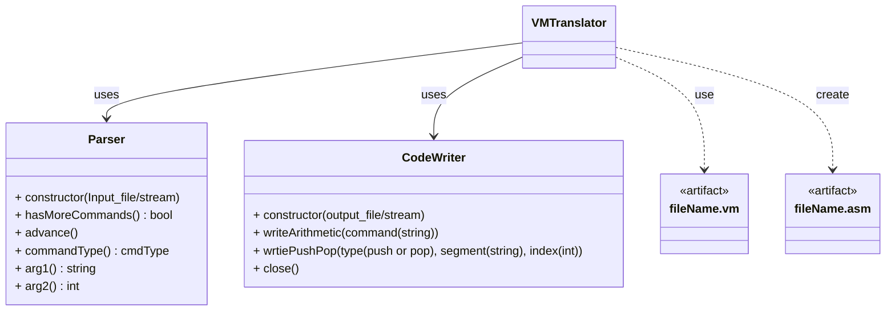

# VM Translator
- nand2tetris Project7, 8에 해당하는 과제
- makefile로 `VMTranslator` 명령으로 실행 가능하도록 하여야 함.
    - 예) `VMTranslator fileName.vm`
- output file인 `fileName.asm`은 input file인 `fileName.vm`이 위치한 경로에 저장되도록 하여야 한다.[^1] 
- data는 https://github.com/peace338/nand2tetris.git 에서 가져옴.

## Architecture

## Reference
[^1]: https://www.nand2tetris.org/project07  
[^2]: https://github.com/peace338/nand2tetris.git