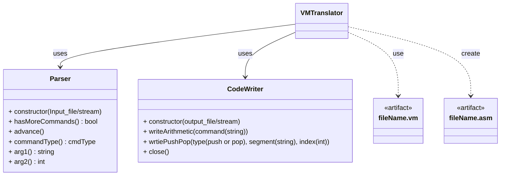

# VM Translator
- nand2tetris Project7, 8에 해당하는 과제
- makefile로 `VMTranslator` 명령으로 실행 가능하도록 하여야 함.

## Architecture

```mermaid
classDiagram
    class VMTranslator
    class Parser {
		+ constructor(Input_file/stream)
	    + hasMoreCommands() bool
		+ advance() 
		+ commandType() cmdType
        + arg1() string
        + arg2() int
		  
    }
    class CodeWriter{
	    + constructor(output_file/stream)
	    + writeArithmetic(command(string))
	    + wrtiePushPop(type(push or pop), segment(string), index(int))
	    + close()
    }
    class fileName.vm {
        <<artifact>>
    }
    class fileName.asm {
        <<artifact>>
    }

    VMTranslator --> Parser : uses
    VMTranslator --> CodeWriter : uses
    VMTranslator ..> fileName.vm : use
    VMTranslator ..> fileName.asm : create
```