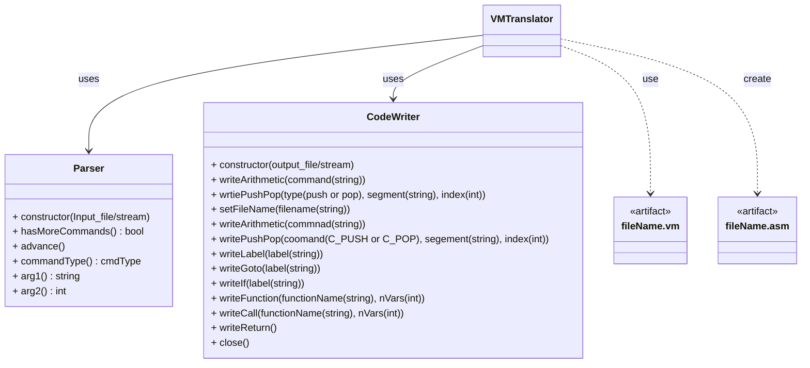

# VM Translator
- nand2tetris Project7, 8에 해당하는 과제
- makefile로 `VMTranslator` 명령으로 실행 가능하도록 하여야 함.
    - 예) `VMTranslator fileName.vm`
- output file인 `fileName.asm`은 input file인 `fileName.vm`이 위치한 경로에 저장되도록 하여야 한다.[^1] 
- 생성된 `*.asm` 파일은 CPU Emulator와 `*.tst`파일을 통해 test할 수 있다.
- data는 https://github.com/peace338/nand2tetris.git 에서 가져옴.

## How To Use
- `make` 로 가상환경 Setup 및 실행.
- `make test`로 test script 실행.
    - [^3]을 보고 필요한 Tool 설치 필요.

## Architecture

## Reference
[^1]: https://www.nand2tetris.org/project07  
[^2]: https://github.com/peace338/nand2tetris.git  
[^3]: https://drive.google.com/file/d/1IkIR8Pwq3PY49QgXpUJOkUUVht-TKIET/view
[^4]: https://www.nand2tetris.org/project08

